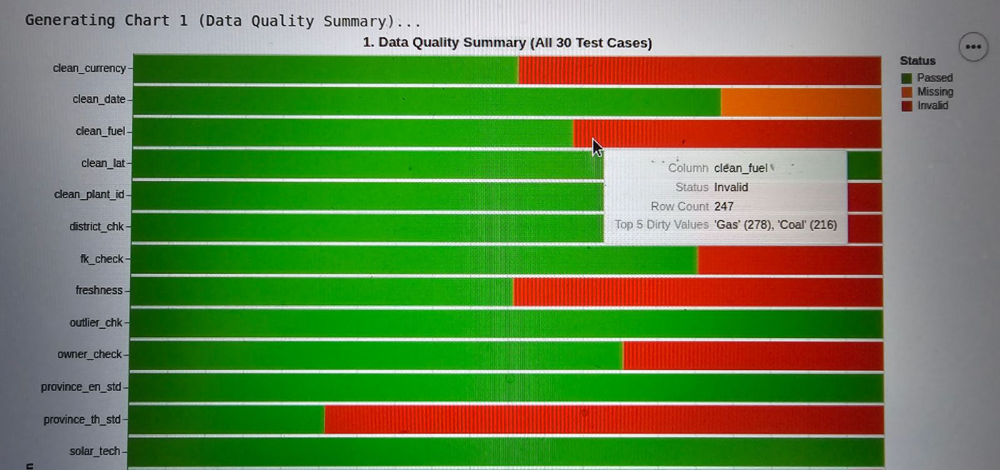

# MonadSquishy: DEDE Thailand Data Lakehouse Pipeline



## 1. Background & Problem Statement

The Department of Alternative Energy Development and Efficiency (DEDE) manages critical energy data for Thailand. However, the data ingestion process currently faces a significant bottleneck known as the **"Silver Layer Gap."** This gap represents the difficult transition from raw, unstructured user uploads (Bronze Layer) to a strict, schema-enforced Data Warehouse (Silver Layer).

### The Challenge

Data received from various sources often contains high-entropy inconsistencies that disrupt standard ETL processes. Common issues include:

* **"Squishy" Data**: Columns often contain mixed types, such as "TBD" strings appearing in date fields.

* **Thai-Specific Formats**: Data frequently uses Buddhist Era years (e.g., 2567), Thai currency symbols (฿), and embedded Thai text.

* **Physics Violations**: Logical impossibilities, such as solar generation occurring at night or `Sold > Gross Generation`.

* **Silent Failures**: Traditional scripts often handle these errors by coercing them to `NaN`. This results in data loss because the context of *why* the data failed is discarded.

## 2. Theoretical Framework

To address these challenges, this pipeline is built on the **MonadSquishy** architecture. This functional data engineering framework is specifically designed to ensure resilience and observability.

### A. The Monad Pattern (Cellular State Management)

Rather than processing raw values directly, the architecture wraps every data cell in a **Monad**. This container provides a consistent interface for state management, holding three key elements:

* **Value**: The actual data payload being processed.

* **Status**: A finite state machine that tracks the data's lifecycle (`Pending` $\to$ `Valid` $\to$ `Success` OR `Dirty`).

* **Logs**: A history of every transformation and validation attempt, ensuring full auditability.

### B. Railway-Oriented Programming (ROP)

Building on the Monad pattern, the pipeline utilizes **Railway-Oriented Programming** to manage control flow. This approach replaces complex `try/catch` blocks with two distinct execution tracks:

* **🟢 Green Track (Happy Path)**: As long as data passes checks, it continues down this track for further processing.

* **🔴 Red Track (Failure Path)**: Once a validator fails, the data is immediately shunted to this track. This "Fail-Fast" mechanism saves CPU cycles by stopping further processing while preserving the error logs for later analysis.

## 3. How to Use the Code

### Prerequisites

The code requires Python 3.8+ and the following libraries:

```bash
pip install pandas numpy altair pandarallel
````

### Execution Steps

1.  **Open the Notebook**: Load the `DEDE_Data_Quality_Pipeline.ipynb` file.

2.  **Generate Mock Data**: The script includes a `generate_dede_data(n)` function. Run this to create synthetic Thai energy data that includes intentional errors, allowing you to test the pipeline's resilience.

3.  **Run the Pipeline**:
    Initialize the engine with your configuration and data, then execute the run command. This process will process the data in parallel.

    ```python
    # 1. Initialize Engine with Config and Data
    engine = SquishyEngine(dede_pipeline_config, df)

    # 2. Run (Executes in Parallel)
    clean_df = engine.run()
    ```

4.  **View the Dashboard**:
    The dashboard provides a visual summary of the data quality:

      * **Green Bar**: Represents clean, usable data.

      * **Red Bar**: Represents invalid data. **Hover over this bar** to reveal the "Top 5 Dirty Values," which helps identifying specific error patterns.

### Extracted Results Feature

In addition to the visual dashboard, the pipeline automatically prints a text summary of the most frequent bad inputs to the console. This immediate feedback helps engineers prioritize which data issues to resolve first.

**Example Output:**

```text
================================================================================
EXTRACTED RESULTS: TOP 5 DATA ISSUES PER COLUMN
================================================================================
COLUMN                    | TOP 5 DIRTY VALUES (Count)
--------------------------------------------------------------------------------
clean_date                | 'TBD' (42), 'Pending' (15)
province_th_std           | 'China' (12), '???' (5)
valid_sold                | 'Physics Violation: Sold > Gross' (24)
================================================================================
```

## 4\. Test Case Reference (All 30 Cases)

The pipeline implements 30 specific Data Quality rules, categorized into four logical groups to address different aspects of data integrity.

### Group A: Bronze Ingestion (Normalization)

*Focus: Normalizing messy flat-file inputs into a standard format.*

| ID | Function Name | Logic / Description |
| :--- | :--- | :--- |
| **TC01** | `TC01_Null_Check` | Rejects `None`, `NaN`, and literals like "TBD", "N/A", "-". |
| **TC02** | `TC02_Thai_Year_Conversion` | Converts Thai BE years (e.g., 2567) to AD (2024). |
| **TC03** | `TC03_Currency_Sanitization` | Removes `฿`, `THB`, and commas from currency strings. |
| **TC04** | `TC04_Thai_Char_Enforcement` | Ensures field contains valid Thai Unicode characters. |
| **TC05** | `TC05_English_Cleanliness` | Ensures field contains **NO** Thai characters (English only). |
| **TC06** | `TC06_Thailand_Geofence` | Validates Lat/Long is within Thailand bounds (5-21°N, 97-106°E). |
| **TC07** | `TC07_Fuel_Standardization` | Maps inputs like "Sun", "PV" to standard "Solar". |
| **TC08** | `TC08_Plant_Code_Format` | Enforces Regex format `^PLT-\d{4}$`. |

### Group B: Fact Table Logic (Business Rules)

*Focus: Enforcing physics and financial validity constraints.*

| ID | Function Name | Logic / Description |
| :--- | :--- | :--- |
| **TC09** | `TC09_Positive_Capacity` | Capacity must be \> 0. |
| **TC10** | `TC10_Non_Negative_Generation` | Generation must be ≥ 0. |
| **TC11** | `TC11_Physics_Grid_Check` | **Multi-Col**: Sold to Grid must be ≤ Gross Generation. |
| **TC12** | `TC12_Curtailment_Cap` | **Multi-Col**: Curtailment must be ≤ Gross Generation. |
| **TC13** | `TC13_Availability_Factor` | Factor must be between 0.0 and 1.0. |
| **TC14** | `TC14_CO2_Calculation` | **Multi-Col**: CO2 ≈ Gross Gen \* Grid Factor (w/ tolerance). |
| **TC15** | `TC15_Uniqueness_Composite` | **Multi-Col**: Combination of Date + Plant Code must be unique. |
| **TC16** | `TC16_Subsidy_Policy` | **Multi-Col**: If Policy="None", Subsidy Paid must be 0. |

### Group C: Dimensional Integrity

*Focus: Ensuring compliance with Master Data standards.*

| ID | Function Name | Logic / Description |
| :--- | :--- | :--- |
| **TC17** | `TC17_Valid_Region` | Must be in [North, South, East, West, Central, North-East]. |
| **TC18** | `TC18_Year_Sync` | **Multi-Col**: Year BE must equal Year AD + 543. |
| **TC19** | `TC19_Future_Date_Block` | Report Date cannot be in the future. |
| **TC20** | `TC20_COD_Validity` | **Multi-Col**: Commercial Op Date must be before Report Date. |
| **TC21** | `TC21_Active_Status` | Status must be Active, Inactive, or Construction. |
| **TC22** | `TC22_Renewable_Only` | Rejects non-RE fuels (Coal, Gas, Nuclear). |
| **TC23** | `TC23_Adder_Rate_Cap` | Adder rate must not exceed regulatory cap (e.g., 10.0). |
| **TC24** | `TC24_Grid_Authority_Map` | **Multi-Col**: Bangkok = MEA; Upcountry = PEA. |

### Group D: Cross-Reference & Completeness

*Focus: Checking relational integrity and identifying statistical outliers.*

| ID | Function Name | Logic / Description |
| :--- | :--- | :--- |
| **TC25** | `TC25_Orphan_Plant_Key` | Plant Key must exist in Dimension Table (Mock check). |
| **TC26** | `TC26_Data_Freshness` | Data must be received within 30 days of generation. |
| **TC27** | `TC27_Owner_Type_Consistency` | Owner Type must be valid (Private/State). |
| **TC28** | `TC28_Solar_Irradiance_Check` | **Multi-Col**: If Fuel="Solar", Irradiance Zone cannot be Null. |
| **TC29** | `TC29_District_Hierarchy` | **Multi-Col**: District must belong to the specified Province. |
| **TC30** | `TC30_Generation_Outlier` | **Multi-Col**: Generation cannot exceed Installed Cap \* 24h \* 31d. |

## 5\. Developer Guide: How to Extend

Expanding the pipeline for new rules is straightforward. You do not need to modify the core engine; instead, simply define atomic functions and update the configuration.

### Step 1: Define a New Function

Choose the appropriate decorator based on your goal: use `@validator` to block bad data or `@transformer` to fix it.

**Scenario A: Validator (Block bad data)**
Use this to reject data that violates business rules.

```python
@validator
def TC31_Wind_Speed_Check(v):
    if float(v) < 0: raise ValueError("Wind speed cannot be negative")
    return v
```

**Scenario B: Transformer (Fix messy data)**
Use this to normalize data into a standard format.

```python
@transformer
def TC32_Normalize_Region_Codes(v):
    mapping = {'North-East': 'NE', 'North': 'N'}
    if v in mapping: return mapping[v]
    raise ValueError("Unknown Region Code")
```

### Step 2: Update the Configuration

Finally, register your new rule by adding it to the `dede_pipeline_config` list. This declarative approach keeps the configuration separate from the logic.

```python
dede_pipeline_config = [
    # ... existing configs ...
    {
        "target": "clean_wind_speed",
        "source": "raw_wind_speed",
        "type": "float",
        "pipeline": [TC01_Null_Check, TC31_Wind_Speed_Check]
    }
]
```
## References:
- https://colab.research.google.com/drive/1vMwHfXMDixnUCE4i8QjO-nzCDXLiR7xk?usp=sharing 
- https://colab.research.google.com/drive/1ZBFpFBy9LvzXxZ35Wz14e-WoTvFp--L7?usp=sharing

